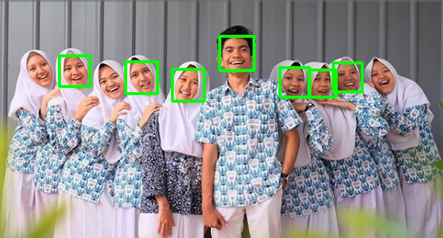
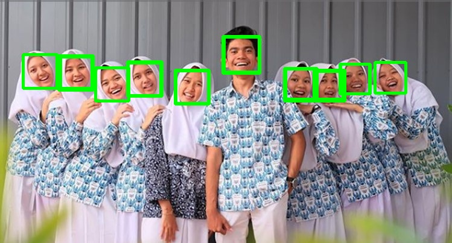

# Face Detection With OpenCV Python
Simple face detection using opencv in python

##Installation
just clone this repo with this argument
```bash
git clone https://github.com/adityatriand/face-detection.git
```
##Attribute
I use cascade classifier to detect a face from image. In this repo, i try to compare between haarcascade frontalface default and haarcascade frontalface alt. For parameter, i use scaleFactor and minNeighbor. For library i use cv2 and numpy.
```python
#for library
import cv2 as cv
import numpy as np

#for classifier
cascade_face_default = cv.CascadeClassifier('haarcascade_frontalface_default.xml')
cascade_face_alt = cv.CascadeClassifier('haarcascade_frontalface_alt.xml')

#for parameter
foto = cv.imread('foto-example.jpg')
foto_gray = cv.cvtColor(foto, cv.COLOR_BGR2GRAY)
result_alt = cascade_face_alt.detectMultiScale(foto_gray, scaleFactor=1.02, minNeighbors=7)
result_default= cascade_face_default.detectMultiScale(foto_gray, scaleFactor=1.02, minNeighbors=7)
```
scaleFactor – Parameter specifying how much the image size is reduced at each image scale. the higher the number, the faster the detection process but weakens its reliability. we can change the value from 1.0 - 3.0

minNeigbors - Parameter specifying how many neighbors each candidate rectangle should have to retain it. This parameter will affect the quality of the detected faces. Higher value results in less detections but with higher quality.

##Result

This is the result of comparison between haarcascade frontalface default and haarcascade frontalface alt

##### result of haarcascade frontalface alt


##### result of haarcascade frontalface default


with the same parameters, haarcascade frontalface default has lower false negatives than the haarcascade frontalface alt